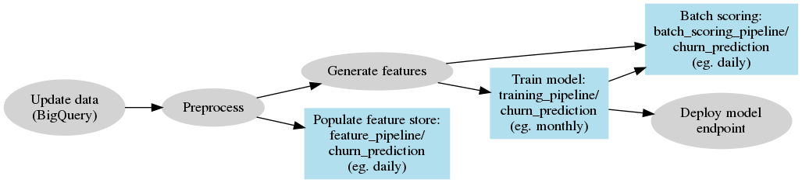

# churn_prediction
[](https://travis-ci.com/basisai/churn_prediction)
[](https://shields.io/)

Preprocess raw data, train and serve ML model for customer churn data.

### Data exploration and Model prototyping
See [notebook](./doc/churn_prediction.ipynb)

### Data processing and model training flowchart


### Run on Bedrock
Parameters will passed to your scripts as environment variables. They can be overwritten when you create a pipeline run. When you create a run, overwrite these default values.

Name | Default value | Description
--- | --- | ---
`TEMP_DATA_BUCKET` | "gs://span-temp-production/" | Bucket to store intermediate data between steps. If the environment is `test-production`, you may use `bdrk-test-temp` which is the pre-created bucket that has write access. You may also use other buckets with write access.
`BIGQUERY_PROJECT` | "span-production" | Only for batch scoring pipeline. Bigquery project to write results to.

### Test your server
```
curl -X POST \
  <MODEL_ENDPOINT_URL> \
  -H 'Content-Type: application/json' \
  -H 'X-Bedrock-Api-Token: <MODEL_ENDPOINT_TOKEN>' \
  -d '{"State": "ME", "Area_Code": 408, "Intl_Plan": 1, "VMail_Plan": 1, "VMail_Message": 21, "CustServ_Calls": 4, "Day_Mins": 156.5, "Day_Calls": 122, "Eve_Mins": 209.2, "Eve_Calls": 125, "Night_Mins": 158.7, "Night_Calls": 81, "Intl_Mins": 11.1, "Intl_Calls": 3}'
```
